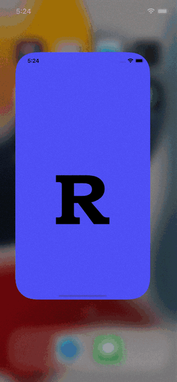
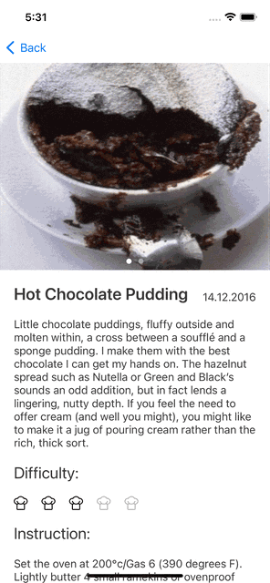

# Recipes

## Contents
1. [Installation](#installation)
2. [Overview](#overview)
3. [Description of features](#description-of-features)
4. [FAQ](#faq)
5. [Technical Requirements](#technical-requirements)

## Installation
Simply run `pod install` and press Run button.

## Overview

<table>
	<thead>
		<tr>
			<th>Launch</th>
			<th>ScrollTable</th>
      <th>Search</th>
		</tr>
	</thead>
	<tbody>
		<tr>
			<td>
				
			</td>
			<td>
				
                       </td>
			<td>
                                
			</td>
		</tr>
	</tbody>
</table>

<table>
	<thead>
		<tr>
			<th>Sorting</th>
			<th>Details</th>
                        <th>Recommendation</th>
		</tr>
	</thead>
	<tbody>
		<tr>
			<td>
				
			</td>
			<td>
				
                        </td>
			<td>
                                
			</td>
		</tr>
	</tbody>
</table>

## Description of features
1. Custom LaunchScreen
2. Search by name
3. Sorting by name and date
4. Present details screen from tap on table cell
5. Recommendation recipes for details screen

## FAQ

Q: Why i chose [MVVM](https://www.wikiwand.com/ru/Model-View-ViewModel) architecture instead of the standard [MVС](https://ru.wikipedia.org/wiki/Model-View-Controller)?  
A: Because i wanted to try a new architectural pattern.

Q: Why used [Coordinator](https://saad-eloulladi.medium.com/ios-coordinator-pattern-in-swift-39a15aa3b01b)?  
A: because I think that controllers should not know about each other.

Q: Why used [SnapKit](https://github.com/SnapKit/SnapKit)?  
A: I wanted to try this technology because before that I had already laid out through NSLayoutConstraint and Anchors ([example](https://github.com/NikitaRekaev/Coder)).

Q: Why used [Alamofire](https://github.com/Alamofire/Alamofire) and [Kingfisher](https://github.com/onevcat/Kingfisher)?  
A: To simplify working with the network, since an [example](https://github.com/NikitaRekaev/Coder) of a native implementation already exists.

Q: Why used [SwiftLint](https://github.com/realm/SwiftLint)?  
A: For style code control and additional static analysis.

Q: Why used [R.swift](https://github.com/mac-cain13/R.swift)?  
A: For when generating, in particular laying paths to assets.

## Technical Requirements

* iOS 13+
* Swift 5
* UIKit
* SnapKit
* Alamofire
* Kingfisher
* SwiftLint
* R.swift
* MVVM-C
